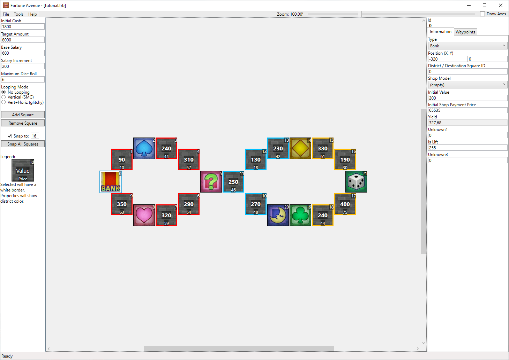

# Your Own Map Template

A short description of your map.

## Screenshots

## Features

| Map Properties    | Value      |
| ----------------- | ---------- |
| Initial Cash      | 1800       |
| Target Amount     | 8000       | 
| Base Salary       | 600        | 
| Salary Increment  | 200        | 
| Maximum Dice Roll | 6          | 
| Looping Mode      | No Looping | 

## Prerequisites

- Needs to replace "Practice Board" tutorial.frb

## Changelog

### v1
- Initial Release

## Authors

- [Deflaktor](https://github.com/Deflaktor)