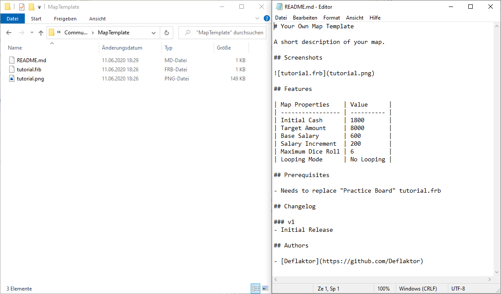
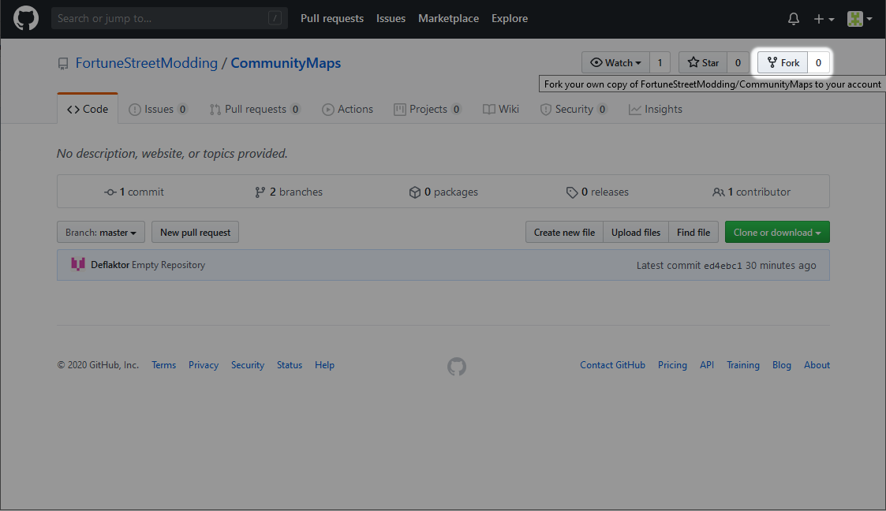
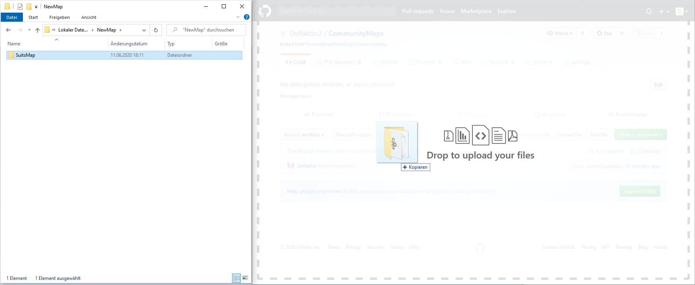
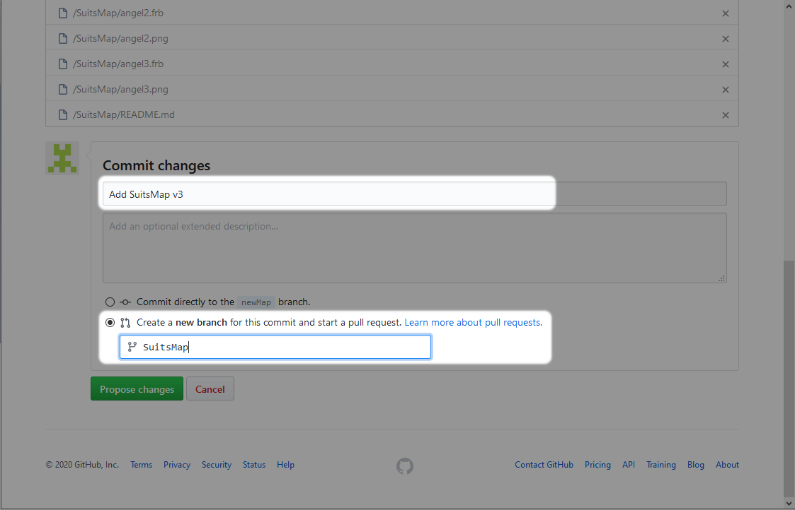
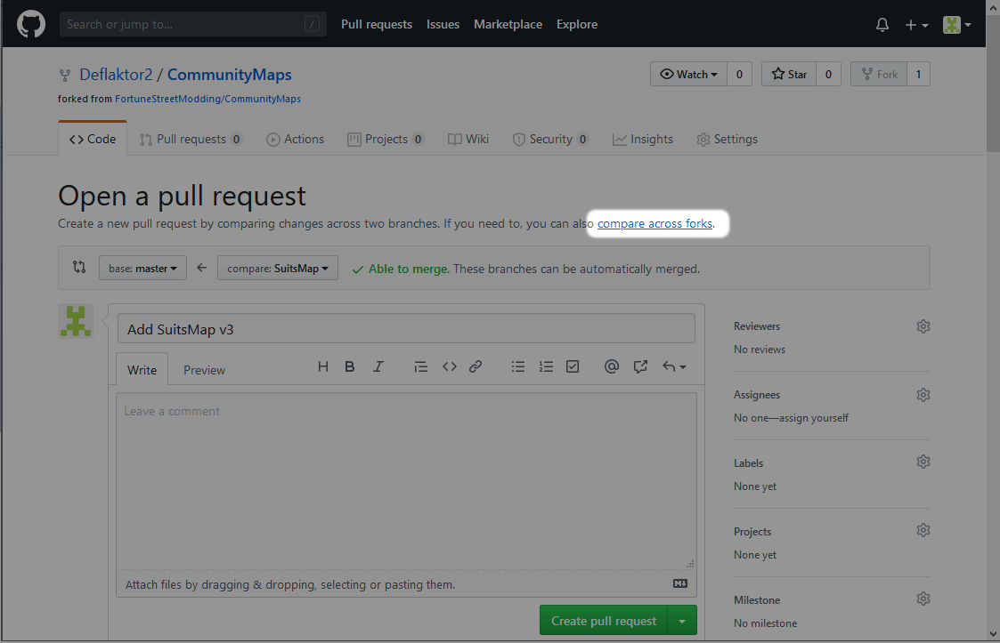
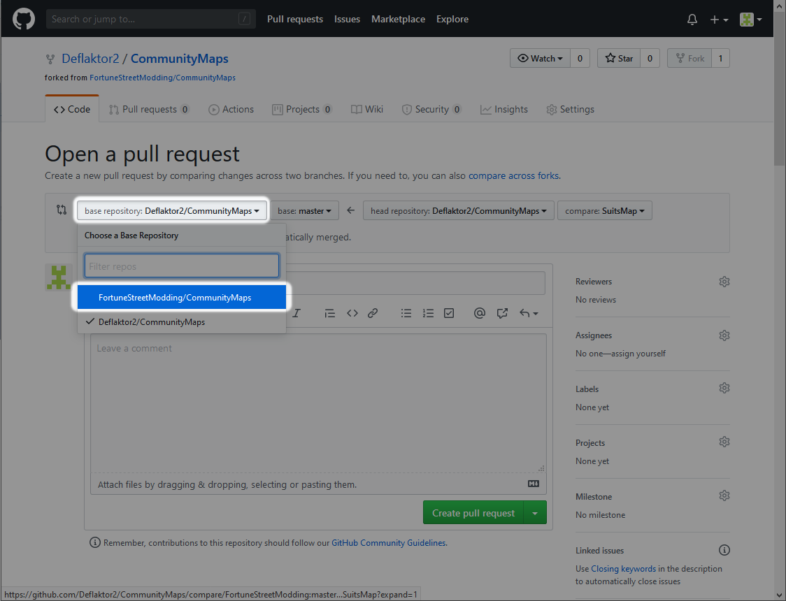
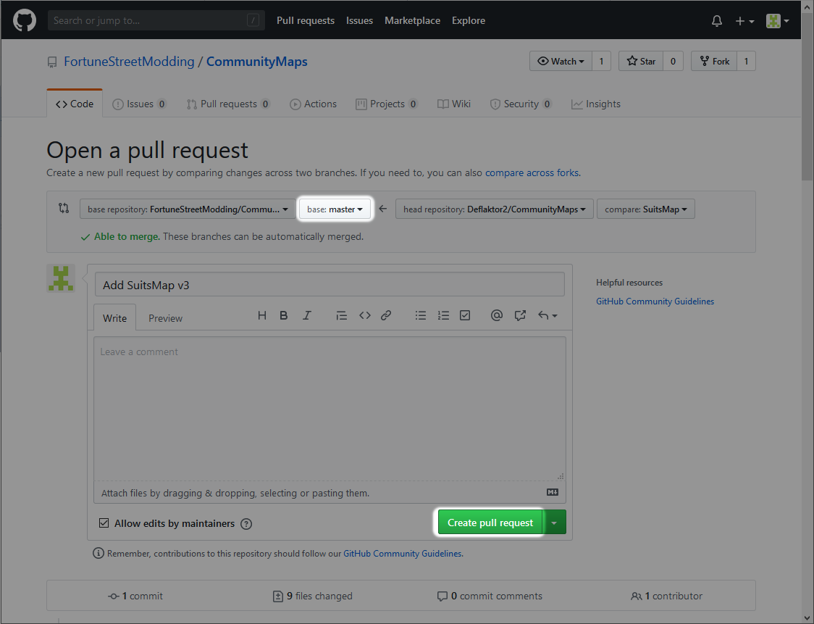

# How to upload a new map

To upload a new map to this repository you must create a pull request using the branch `master` as base create a new folder for your map. The folder must contain:
- 1 .md file
- 1-4 frb files
- at least one screenshot

You can take a look at one of the map templates [TemplateMap_Colony](../../tree/master/TemplateMap_Colony) or [TemplateMap_Colossus](../../tree/master/TemplateMap_Colossus) or the other maps in this repository.

**Please test your map at least one full game before creating a pull request!**

## Step by step guide

1. Prepare your map folder. Take a look into one of the map templates [TemplateMap_Colony](../../tree/master/TemplateMap_Colony) or [TemplateMap_Colossus](../../tree/master/TemplateMap_Colossus) how your map folder must look like.

The folder must contain:
- 1 .md file
- 1-4 frb files
- at least one screenshot

2. Create a fork.

3. Drag'n'drop your map folder into your forked repository.

4. Select `Create a new branch for this commit and start pull request`. Give the branch the same name as your map.

5. Click on `compare across forks`.

6. Select base repository `FortuneStreetModding/CommunityMaps`.

7. Make sure the base is set to `master`. You can now create the pull request.

