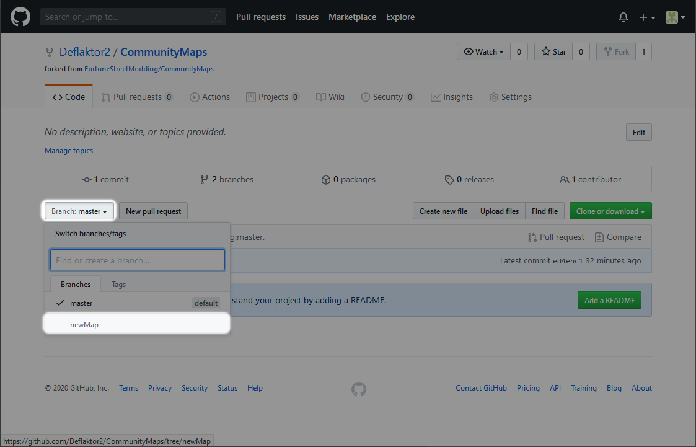
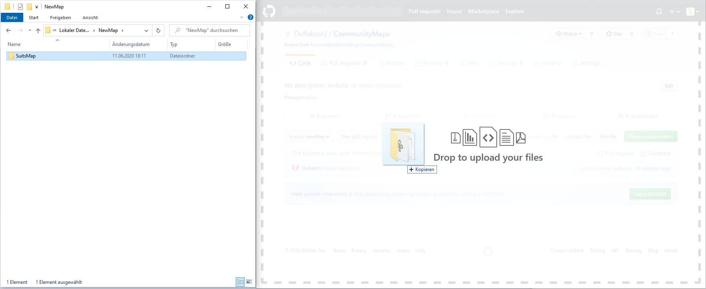
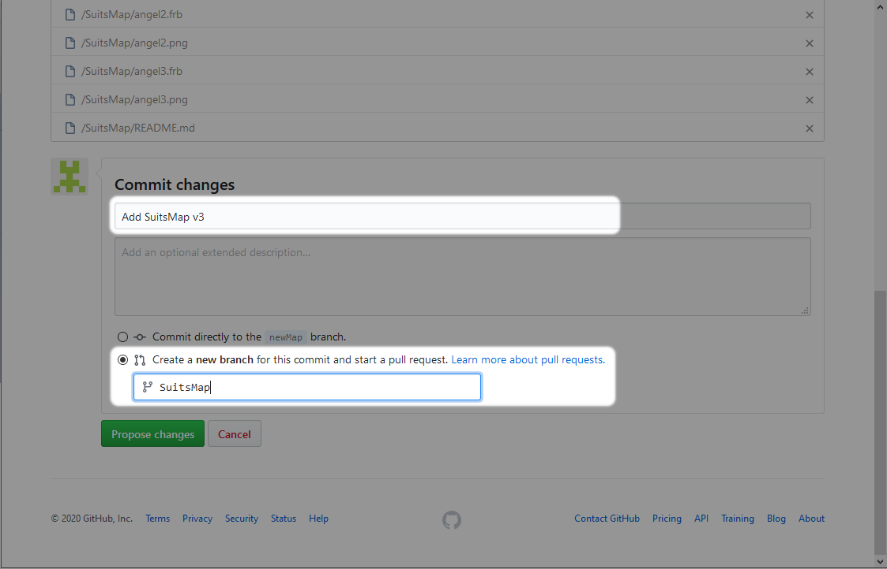
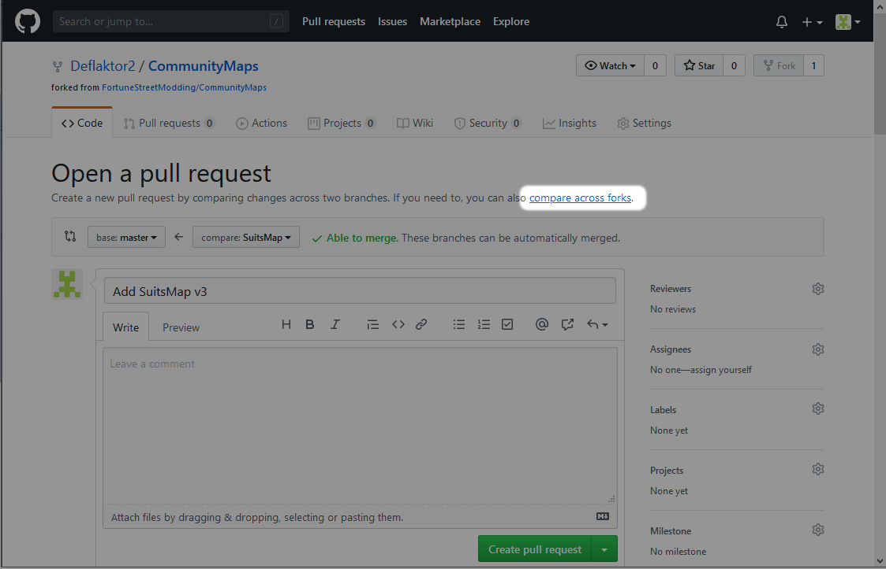
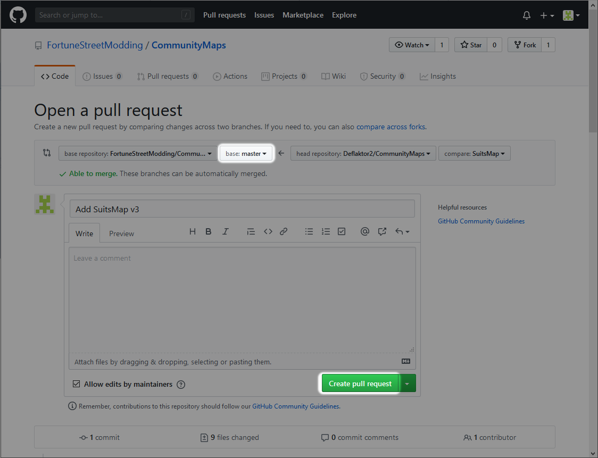

# How to upload a new map

1. Prepare your map folder. Take a look into [MapTemplate](../../tree/mapTemplate) how your map folder must look like.

2. Create a fork.

3. Switch to the branch `newMap`.

4. Drag'n'drop your map folder into the repository.

5. Select `Create a new branch for this commit and start pull request`. Give the branch the same name as your map.

6. Click on `compare across forks`.

7. Select base repository `FortuneStreetModding/CommunityMaps`.

8. Make sure the base is set to `master`. You can now create the pull request.

