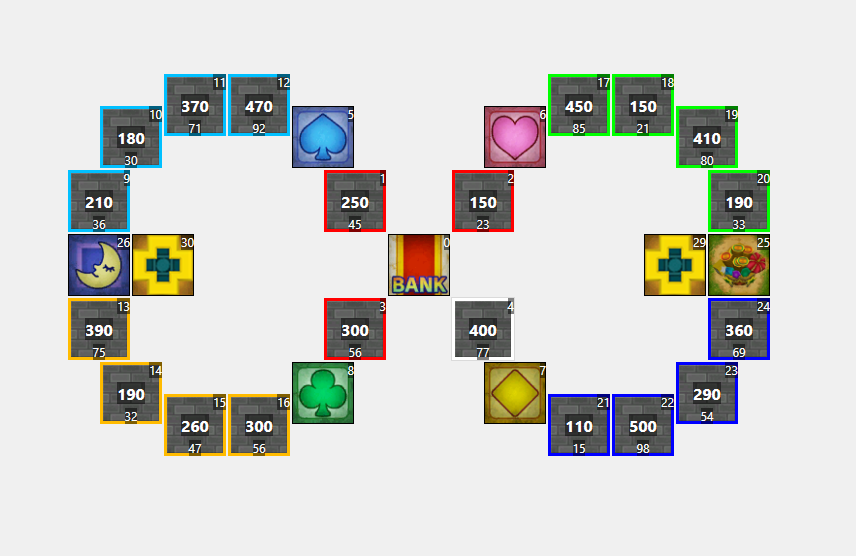

# Serpentine Castle Avenue

A small and balanced map for quick games.

## Screenshots

## Features

### Map Properties

| Map Properties    |      Value |
| ----------------- | ---------- |
| Initial Cash      |       1200 |
| Target Amount     |      10000 |
| Base Salary       |        300 |
| Salary Increment  |        225 |
| Maximum Dice Roll |          6 |
| Looping Mode      |       None |

### Map Configuration

  
Click to expand!

| Map Configuration |                  Value |
| ----------------- | ---------------------- |
| Rules             |               Standard |
| Theme             |            DragonQuest |
| FRB File Name 1   | serpentinecastleavenue |
| FRB File Name 2   |                        |
| FRB File Name 3   |                        |
| FRB File Name 4   |                        |

### Map Background

  
Click to expand!

| On  | Background | Description          |
| --- | ---------- | -------------------- |
| :o: | bg101      | Trodain Castle       |
|     | bg109      | The Observatory      |
|     | bg102      | Ghost Ship           |
|     | bg105      | Slimenia             |
|     | bg104      | Mt. Magmageddon      |
|     | bg106      | Robbin' Hood Ruins   |
|     | bg004      | Mario Stadium        |
|     | bg008      | Starship Mario       |
|     | bg002      | Mario Circuit        |
|     | bg001      | Yoshi's Island       |
|     | bg005      | Delfino Plaza        |
|     | bg003      | Peach's Castle       |
|     | bg107      | Alefgard             |
|     | bg006      | Super Mario Bros     |
|     | bg007      | Bowser's Castle      |
|     | bg009      | Good Egg Galaxy      |
|     | bg103      | The Colossus         |
|     | bg108      | Alltrades Abbey      |
|     | bg901      | Practice Board       |

### Localization

  
Click to expand!

    
| Message   | String |
| --------- | ------ |
| Name (DE) | Serpentinen-Schlossallee |
| Desc (DE) | Eine kleine und ausgeglichene Karte für kurze Runden. |

### Venture Cards

  
Click to expand!

| ID  | On  | Description                                                                                                      |
| --- | --- | ---------------------------------------------------------------------------------------------------------------- |
|   1 |     | Adventurous turning point! You can choose which way to move on your next go, (player's name).                    |
|   2 | :o: | Venture on! Roll the die again and move forward.                                                                 |
|   3 |     | Venture through space! Zoom over to any non-venture, non-suit square you like!                                   |
|   4 | :o: | Moneymaking venture! Roll the die and get 40 times the number shown in gold coins from the player in 1st place!  |
|   5 |     | Venture through space! Zoom over to any shop or vacant plot!                                                     |
|   6 | :o: | Venture through space! Zoom over to any venture or suit square!                                                  |
|   7 | :o: | Special bonus! Your shops all grow by 7%!                                                                        |
|   8 | :o: | Venture on! Everyone's shop prices increase by 30%! Now roll the die and move again.                             |
|   9 | :o: | Venture on! Everyone's shops close for the day! Now roll the die and move again.                                 |
|  10 | :o: | Venture on! Everyone's shop prices cut in half! Now roll the die and move again.                                 |
|  11 |     | Moneymaking venture! Roll the die and get 11 times the number shown in gold coins from all other players!        |
|  12 |     | Capital venture! You can invest capital in any of your shops.                                                    |
|  13 |     | Misadventure! The values of all your shops drop by 13%!                                                          |
|  14 |     | Misadventure! You give everyone 30G each!                                                                        |
|  15 | :o: | Moneymaking venture! Roll the die and get 50 times the number shown in gold coins from the bank!                 |
|  16 |     | Random venture! Shops expand in three districts picked at random!                                                |
|  17 |     | Special bonus! You receive half of your salary!                                                                  |
|  18 | :o: | Misadventure! The bank is forcibly buying you out! You're compelled to sell a shop for only twice its value.     |
|  19 | :o: | Price hike venture! Your shop prices go up by 30% until your next turn.                                          |
|  20 | :o: | Revaluation venture! You can expand any one of your shops by 20%.                                                |
|  21 | :o: | Random venture! You receive 20 stocks in a district picked at random!                                            |
|  22 | :o: | Cashback venture! You can sell a shop back to the bank for twice its shop value.                                 |
|  23 | :o: | Revaluation venture! You can expand any one of your shops by 50%.                                                |
|  24 |     | Misadventure! The bank is forcibly buying you out! You're compelled to sell a shop for 200G more than its value. |
|  25 | :o: | Misadventure! Your shop prices halve until your next turn!                                                       |
|  26 |     | Lucky venture! You get a big commission until your next turn!                                                    |
|  27 | :o: | Special bonus! You receive 27 times the number of shops you own in gold coins from the bank!                     |
|  28 | :o: | Cameo adventure! A goodybag appears!                                                                             |
|  29 | :o: | Freebie! Take a Heart!                                                                                           |
|  30 | :o: | Venture on! All shops charge a 100G flat rate! Now roll the die and move again.                                  |
|  31 |     | Random venture! Shops expand by 10% in a district picked at random!                                              |
|  32 | :o: | Random venture! Shops expand by 20% in a district picked at random!                                              |
|  33 | :o: | Cashback venture! You can sell a shop back to the bank for three times its shop value.                           |
|  34 |     | Dicey adventure! Roll 1/3/5 and your shops close for the day. Roll 2/4/6 and everyone else's shops close.        |
|  35 |     | Stock venture! You can sell stocks you own at 35% above the market value.                                        |
|  36 | :o: | Capital venture! You can pay 100G for the chance to invest in your shops.                                        |
|  37 |     | Random venture! Shops expand by 30% in a district picked at random!                                              |
|  38 | :o: | Stock venture! You can buy stocks in a district of your choice at 10% above the market value.                    |
|  39 | :o: | Suit venture! Buy a Suit Yourself card for 100G.                                                                 |
|  40 | :o: | Misadventure! You give away 10% of your ready cash to the player in last place!                                  |
|  41 | :o: | Misadventure! Stock prices fall by 10% in a district picked at random!                                           |
|  42 |     | Misadventure! Stock prices fall by 20% in a district picked at random!                                           |
|  43 |     | Misadventure! You pay an assets tax of two gold coins per unit of stock that you own!                            |
|  44 | :o: | Misadventure! Roll the die and pay 44 times the number in gold coins to the player in last place!                |
|  45 | :o: | Dicey adventure! Roll 1/3/5 to warp to a take-a-break square. Roll 2/4/6 to warp to the arcade.                  |
|  46 | :o: | Misadventure! You drop your wallet and lose 10% of your ready cash!                                              |
|  47 | :o: | Dicey adventure! Roll 2-6 to get all the suits. Roll 1 and lose all your suits.                                  |
|  48 |     | Misadventure! All shops in a district picked at random fall in value by 10%!                                     |
|  49 | :o: | Misadventure! All shops in a district picked at random fall in value by 20%!                                     |
|  50 | :o: | Venture on! Move forward the same number of squares again.                                                       |
|  51 |     | Venture on! Move forward 1 square more.                                                                          |
|  52 |     | Venture on! Move forward another 2 squares.                                                                      |
|  53 |     | Venture through space! Zoom over to the bank!                                                                    |
|  54 |     | Venture through space! Pay 100G to zoom straight to the bank!                                                    |
|  55 | :o: | Venture on! Roll the die again and move forward (with an invitation to browse thrown in!).                       |
|  56 |     | Venture on! Roll the die again and move forward (with a half-price special offer thrown in!).                    |
|  57 |     | Venture through space! Zoom to any square you like.                                                              |
|  58 | :o: | Venture through space! Pay 100G to zoom to any non-venture, non-suit square you like!                            |
|  59 | :o: | Stock venture! You can buy stocks in a district of your choice at 10% below the market value.                    |
|  60 | :o: | Random venture! Stock prices increase by 10% in a district picked at random!                                     |
|  61 |     | Special bonus! You receive a 10% dividend on your stocks!                                                        |
|  62 | :o: | Special bonus! You receive a 20% dividend on your stocks!                                                        |
|  63 | :o: | Random venture! Stock prices increase by 20% in a district picked at random!                                     |
|  64 |     | Random venture! Stock prices increase by 30% in a district picked at random!                                     |
|  65 |     | Forced buyout! You can buy a vacant plot or shop for five times its value, whether someone else owns it or not.  |
|  66 |     | Special bonus! You receive 10 of the most valuable stocks!                                                       |
|  67 |     | Stock venture! You can buy stocks in a district of your choice.                                                  |
|  68 |     | Special arcade adventure! You're invited to play Memory Block!                                                   |
|  69 | :o: | Stock venture! You can sell stocks you own at 20% above the market value.                                        |
|  70 |     | Special bonus! You get a sudden promotion and receive a salary! (You lose any suits you have.)                   |
|  71 | :o: | Capital venture! You can invest up to 200G of the bank's money in your shops.                                    |
|  72 | :o: | Dicey adventure! Roll 1/3/5 to take 20 times the number of your shops in gold coins. Roll 2/4/6 to pay the same. |
|  73 |     | Property venture! You can buy any unowned shop or vacant plot.                                                   |
|  74 |     | Misadventure! You are forced to auction one of your shops (with a starting price of twice the shop's value).     |
|  75 | :o: | Property venture! You can buy any unowned shop or vacant plot for twice its value.                               |
|  76 |     | Special arcade adventure! You're invited to play Round the Blocks!                                               |
|  77 | :o: | Freebie! Take five of each district's stocks.                                                                    |
|  78 |     | Property venture! You can buy any unowned shop or vacant plot for 200G more than its value.                      |
|  79 |     | Forced buyout! You can buy a vacant plot or shop for three times its value, whether someone else owns it or not. |
|  80 | :o: | Freebie! Take a Spade!                                                                                           |
|  81 | :o: | Misadventure! All other players can only move forward 1 on their next turn.                                      |
|  82 | :o: | Freebie! Take a Club!                                                                                            |
|  83 | :o: | Dicey adventure! Roll 1/3/5 and warp to a random location. Roll 2/4/6 and everyone else warps.                   |
|  84 | :o: | Moneymaking venture! The winning player must pay you 10% of their ready cash!                                    |
|  85 |     | Moneymaking venture! Roll the die and get 85 times the number shown in gold coins from the bank!                 |
|  86 |     | Moneymaking venture! Take 100G from all other players!                                                           |
|  87 | :o: | Venture on! Roll the special all-7s-and-8s die and move forward again.                                           |
|  88 | :o: | Misadventure! All other players swap places!                                                                     |
|  89 | :o: | Freebie! All players take a Suit Yourself card!                                                                  |
|  90 | :o: | Price hike venture! All shop prices go up by 30% until your next turn.                                           |
|  91 | :o: | Cameo adventure! A healslime appears!                                                                            |
|  92 |     | Cameo adventure! Lakitu appears!                                                                                 |
|  93 |     | Dicey adventure! Roll 1/3/5 and your shops expand by 10%. Roll 2/4/6 and everyone else's shops expand by 5%.     |
|  94 | :o: | Freebie! Take a Diamond!                                                                                         |
|  95 |     | Misadventure! You throw an impromptu party. All other players come to your location!                             |
|  96 | :o: | Misadventure! All players scramble to another player's location!                                                 |
|  97 | :o: | Stock rise venture! Increase stock value by 20% in a district of your choice.                                    |
|  98 | :o: | Forced buyout! You can buy a vacant plot or shop for four times its value, whether someone else owns it or not.  |
|  99 |     | Freebie! What's inside...?                                                                                       |
| 100 | :o: | Freebie! Take a Suit Yourself card!                                                                              |
| 101 |     | Special bonus! Your shops all grow by 21%!                                                                       |
| 102 |     | Moneymaking venture! Roll the die and get 33 times the number shown in gold coins from all other players!        |
| 103 |     | Misadventure! The values of all your shops drop by 25%!                                                          |
| 104 |     | Misadventure! You give everyone 80G each!                                                                        |
| 105 |     | Moneymaking venture! Roll the die and get the number shown x your level x 40G from the bank!                     |
| 106 |     | Freebie! Roll the die and get half the number shown of Suit Yourself cards! (Decimals will be rounded down.)     |
| 107 |     | Revaluation venture! You can expand any one of your shops by 30%.                                                |
| 108 |     | Cashback venture! You can sell a shop back to the bank for four times its shop value.                            |
| 109 |     | Revaluation venture! You can expand any one of your shops by 75%.                                                |
| 110 |     | Special bonus! You receive 77 times the number of shops you own in gold coins from the bank!                     |
| 111 |     | Cashback venture! You can sell a shop back to the bank for 500G more than its shop value.                        |
| 112 | :o: | Special bonus! You receive 100 times the number of shops you own in gold coins!                                  |
| 113 |     | Moneymaking venture! Roll the die and get the number shown x your level x 20G from the bank!                     |
| 114 |     | Moneymaking venture! Take your level times 40G from all other players!                                           |
| 115 | :o: | Misadventure! All other players can only move forward 7 on their next turn.                                      |
| 116 |     | Moneymaking venture! Roll the die and get 60 times the number shown in gold coins from the player in 1st place!  |
| 117 |     | Adventurous turning point! Everyone gets to choose which way to move on their next go.                           |
| 118 | :o: | Lucky venture! You get a really big commission until your next turn!                                             |
| 119 | :o: | Misadventure! You give 20% of your ready cash to the player in last place!                                       |
| 120 |     | Misadventure! You drop your wallet and lose 20% of your ready cash!                                              |
| 121 |     | Capital venture! You can invest up to 400G of the bank's money in your shops.                                    |
| 122 | :o: | Moneymaking venture! The winning player must pay you 20% of their ready cash!                                    |
| 123 |     | Dicey adventure! Roll 1/3/5 and your shops expand by 20%. Roll 2/4/6 and everyone else's shops expand by 5%.     |
| 124 |     | Suit venture! Buy a Suit Yourself card for 50G.                                                                  |
| 125 |     | Dicey adventure! Roll 1/3/5 to warp to a boon square. Roll 2/4/6 to warp to the arcade.                          |
| 126 | :o: | Revaluation venture! Roll the die and expand your shops by 2% for each number.                                   |
| 127 |     | Special arcade adventure! You're invited to play Round the Blocks and Memory Block!                              |
| 128 |     | Special bonus! You receive 55 times the number of shops you own in gold coins from the bank!                     |

## Changelog

### v2
- Added additional configuration settings to be used by CSMM
- Adjusted shop values on the map
- Deleted the boon square as the venture card for it is disabled
- Renamed to Serpentine Castle Avenue

### v1
- Initial Release

## Authors

- [Deflaktor](https://github.com/Deflaktor)